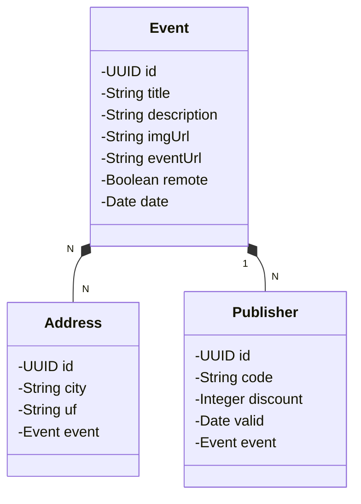

## :construction: - Eventos Tec
- Backend for eventos tec
- Aplicação para gerenciar eventos de tecnologia, permitindo o:
  -  cadastro;
  -  listagem;
  -  filtragem;
  -  detalhamento de eventos;
  -  associação de cupons de desconto.

##

## 📋 - Diagrama de Classes:

##

## ⚙️ - Diagrama de Funcionalidade:

